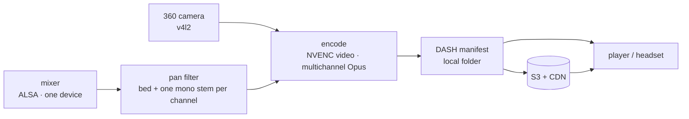

# Live scene setup — editor walkthrough

From cold hardware to a 360° stream with ambisonic audio and per-musician stems.
Every field of the editor's **LIVE** panel, in the order you fill it, and what each
one breaks when it is wrong.

Companion documents: **[`produccion-hardware.md`](produccion-hardware.md)** (machine,
network and S3 spec) and **[`core-api.md`](core-api.md)** (engine API).

> The editor runs on the **capture machine** — the one with the camera and the mixer
> plugged in. You reach it from any browser on the network, but the devices it lists
> are always the ones attached to the machine running `node server.js`.

---

## The idea in one picture

The ambisonic bed and every musician's stem arrive **together**, as channels of a
single multichannel capture device, and they leave together as one multichannel Opus
track inside the DASH manifest. One stream means one clock: the stems stay
sample-accurate against the bed with nothing to synchronize.

So the whole live setup reduces to one question, answered once in the editor:
**which channel carries what**.

```
ch 0..3   FOA bed — W, X, Y, Z      → binaural decode + head rotation
ch 4      musician 1                → panned at its azimuth · spotlight
ch 5      musician 2                → panned at its azimuth · spotlight
ch n      …                         → up to the device's channel count
```



---

## 1. Start the server on the capture machine

```bash
cd Livestreamed_Immersive_Player
LC_ALL=C node server.js
```

**Why `LC_ALL=C`.** The device list is parsed from `arecord -l`, whose output is
*translated*. On a machine set to Italian or Spanish it prints `scheda` / `tarjeta`
instead of `card`, the parser matches nothing, and the ALSA dropdown comes up empty
with no error anywhere. Video still works, because `v4l2-ctl` is not localized —
which makes the symptom look like an audio problem when it is a language problem.

Open `https://<capture-machine-ip>:60000/editor.html`, accept the self-signed
certificate, and switch the tab from **VOD · files** to **LIVE · USB/UDP**.

## 2. Pick the 360 video source

| Field | What to put |
|---|---|
| **Device** | Choose by label, not by number — `/dev/videoN` is reassigned when you replug. Cameras needing the Insta360 SDK bridge appear as `/dev/video10` only after pressing *Initialize Insta360 camera*; cameras the kernel already exposes as UVC show up directly, and then the bridge is not needed at all. |
| **Resolution** | Leave it empty and you get the camera's default, which on most 360 cameras is a **1920×1080 webcam mode, not equirectangular**. Set it explicitly. |
| **FPS** | Match what the driver will give, or it overrides you and logs `The driver changed the time per frame`. |
| **Input format** | `mjpeg` for anything above 1080p — raw `yuyv422` cannot fit a 4K frame down a USB cable. |

List what the camera really offers:

```bash
v4l2-ctl -d /dev/video6 --list-formats-ext
```

## 3. Point at the mixer, and declare its channel count

Ask the device what it accepts instead of guessing:

```bash
arecord -D hw:1,0 --dump-hw-params -d 1 /dev/null
```

It prints the exact `CHANNELS`, `RATE` and `FORMAT`. Usually all three are fixed, and
every one of them is a way for the encode to fail on launch. **Total ch.** must equal
`CHANNELS`.

Two things about the dropdown: if it is empty the server could not parse `arecord -l`
(go back to step 1), and the list is fetched **once, on page load** — plug the mixer
in first, then reload with `Ctrl+Shift+R`.

Leave **A/V delay** at 0; step 7 measures it.

> **`[alsa] cannot set sample format … Invalid argument`** means the device rejected
> the sample format. Professional interfaces are frequently **S32_LE only** and do not
> accept the 16-bit default. `--dump-hw-params` says so under `Available formats`.

## 4. Declare the four ambisonic channels

Four device channel indices in the order **W, X, Y, Z** — the component, never the
socket it happened to land on. The convention beside them says how the recording is
already encoded: **FuMa** is reordered and rescaled to ACN/SN3D for the player,
**AmbiX** is passed through untouched.

Tick *Convert NT-SF1 A-format → B-format* **only** if the four raw capsules arrive as
they leave the microphone. If a plugin or the DAW already converted, ticking it
rotates the sound field a second time — and nothing downstream can detect that,
because a rotated field is still a valid field. It simply sounds wrong in a way nobody
can point at.

## 5. Give every musician a channel

In LIVE mode each musician row grows a small **`ch`** box: the device channel that
musician arrives on. It is the one field in the panel with **no usable default**, and
the encode will not start without it.

> **`[Parsed_pan] Syntax error near "c"`**, with a filter string containing
> `pan=mono|c0=c` — a channel index with nothing after the `c`. One or more musicians
> have an empty `ch`. Scenes carried over from a VOD take are the usual source: the
> musicians already exist, with names and positions, and no channels.

**Verify the mapping instead of assuming it.** Channels 4, 5, 6… is a reasonable
guess, not the truth: on a digital desk the USB sends are routed in the desk's own
menu, so channel 5 on the surface need not be channel 5 over USB.

```bash
arecord -D hw:1,0 -c 18 -f S32_LE -r 48000 -d 30 /tmp/map.wav   # each musician plays in turn
ffmpeg -i /tmp/map.wav -filter_complex astats=metadata=1 -f null - 2>&1 \
  | grep -E 'Channel:|RMS level'
```

The channel that lights up while the drummer plays is the number that goes in the
drummer's box.

## 6. Place them in space

The radar is a top-down view with the listener at the centre and the camera looking up
the page. Dragging a dot sets **azimuth, and only azimuth** — the dot rides a fixed
ring, because distance is not something the scene stores. The two rings and the cross
are there to judge angles by eye, not to mean near and far.

Read the compass off the labels, because the sign is the opposite of a clock:

```
                 FRONT 0°
                     ▲
                     │
        +90°  ◀──────●──────▶  −90°
             (left)  │  (right)
                     ▼
              behind ±180°
```

- **Top — 0°** is the front of the video, whatever the camera was pointed at.
- **Left is positive** (+90°), **right is negative** (−90°).
- **Bottom** is directly behind the listener, ±180°.

Click a musician and the panel beside the radar opens on that one:

| Field | What it is |
|---|---|
| **Azimuth °** | The number you just dragged, typed exactly — useful for round angles, or when two players overlap on the radar and the dot is hard to grab. |
| **Elevation °** | Typed, never dragged: a top-down view has nowhere to show height. Positive is up. Leave it at 0 for a band on the camera's floor; raise it for a choir on risers or a camera slung below the players. |
| **Gain dB** | A trim for the take, not a mix control. If one musician was recorded a couple of dB under the bed, the spotlight can never lift them clear of it — no amount of `maxBoost` fixes a stem that starts buried. Match them here first, then tune the spotlight. |

> **If the whole scene is rotated** — every musician equally wrong, the band coherent
> but turned as a block — do not drag them one by one. That is the **microphone turned
> relative to the camera**, and it is one scene-level number: *Analyse bed* measures it
> from the recording and reports it as a yaw offset (plus, occasionally, a mirror).
> Apply that, and every musician you placed stays placed.

Placement is read from `scene.json` when the player loads, so you can keep adjusting
angles between takes and just reload — no re-encode. The same azimuth and elevation are
what the AR mode uses to hang each musician's marker around the listener, so a scene
placed carefully here arrives placed in the headset.

## 7. Measure the A/V delay

The camera's stitching delays the picture, so the audio arrives early and you add
delay to the audio until they meet. Press **📐 Auto-measure delay**, stay quiet for a
second, then give one sharp **clap** in front of the camera — a single action that is
both seen and heard. The field fills in with the milliseconds. In a busy scene press
**📷 ROI** first and drag a box over the spot where you will clap.

**Re-measure it at every setup.** The number belongs to the *capture chain*, not to
the camera model: a plain webcam lands near 500 ms, a stitching 360 camera lands
elsewhere, and a value inherited from the last venue is simply wrong. Confirm it on
the stream you actually watch — in the player console `engine.setOutputDelay(ms)` adds
audio delay live; whatever value locks the clap, *plus* the delay already in the
field, is the correct one.

Both buttons hold the ALSA device exclusively. Stop them before going live.

## 8. Choose the encode, and where it publishes

| Field | Guidance |
|---|---|
| **Video codec** | `h264_nvenc` for anything live at 4K: the GPU encodes at fixed cost regardless of content, software encoding does not reach real time. Video in MP4 + multichannel Opus in WebM inside one manifest — mixed containers, which is what the headset browser accepts. |
| **Segment s** | Most of the end-to-end latency lives here. 6 s is the safe default over a CDN; drop to 2 while iterating locally. |
| **Publish to S3** | A bucket URL, never a CloudFront URL. Empty = everything stays local, which is the right choice for a bring-up test on the venue's network. |
| **AWS region** | Region of that bucket. Credentials live on the machine (`aws configure`), never in `scene.json` — that file is served to every client. |

**Save scene**, then **Start LIVE**.

## 9. Watch the first thirty seconds

| Signal | Meaning |
|---|---|
| `speed=1.0x` or higher | Real time. Below that the stream falls behind for good — lower resolution or bitrate. |
| `publishing → s3://…` | The uploader started. Missing line = the bucket field was empty and nothing is leaving the machine. |
| `xrun` / `underrun` | The sound card is not draining. Usually something still holds the ALSA device — the measurement tools from step 6. |
| `manifest incompleto … omitida` | Not an error. The uploader refused a manifest caught mid-rewrite; the next pass sends the complete one. |

Open the player against the local manifest first, and only through the CDN once the
local one is right:

```
index.html?src=https://<host>:60000/encoded/manifest.mpd     # local, for iterating
index.html?src=https://<cloudfront>/manifest.mpd             # published
```

On the headset use the machine's IP rather than `localhost`, and accept the
certificate warning once before an audience is waiting.

---

## Failures worth recognizing on sight

All of these have been hit in the field. They share a shape: the error names the
symptom, never the cause.

| What you see | What it is | Fix |
|---|---|---|
| ALSA dropdown empty, cameras fine | Device list parsed from localized `arecord` output | Start the server with `LC_ALL=C` |
| Device list stale after replugging | Devices are fetched once, on page load | `Ctrl+Shift+R` |
| `cannot set sample format` | Interface does not accept the 16-bit default | Check `--dump-hw-params`; capture as `S32_LE` |
| `Syntax error near "c"` | A musician has no channel number | Fill every `ch` box, save, relaunch |
| Video is 1920×1080, not 360 | Camera defaulted to webcam mode | Set the equirectangular resolution explicitly |
| Picture plays, audio silent | Missing CORS headers taint the media element | Set CORS on the bucket or CDN |
| Nothing uploads, no error | `sudo` stripped the environment and moved `$HOME` | Run as your normal user |

## What you can change without re-encoding

Placement on the radar, spotlight tuning and the musicians' names all live in
`scene.json` and are read by the player at load — reload the page and they apply.
Only a change of *sources* (devices, channels, resolution) needs the encode restarted.
